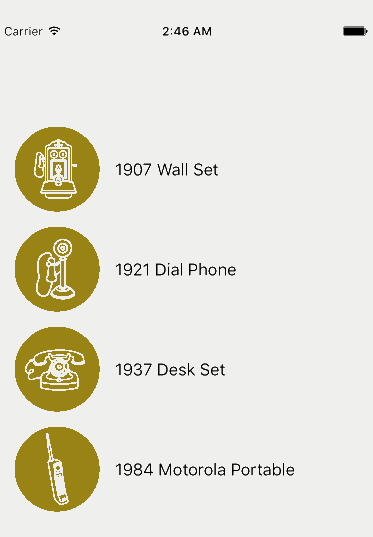

# GoodAsOldPhones-Swift

  

This repo captures the coding I did while following along with the [App Evolution with Swift](https://www.codeschool.com/courses/app-evolution-with-swift) course from @codeschool. 

So, why start now with Swift? Well, this weekend was a Free Weekend on [Code School](https://www.codeschool.com) meaning anyone who had signed up with them could take any of their courses during a 48hr window. This is a fantastic way to 'try before you buy'. So, I took advantage and here I am, about 5 hours later reporting out on how the course went for me. Bottom line, I was able to follow along and build my very first iOS Swift app. 

The purpose of this Readme is to just highlight a few observations from taking the course. Remember, I hadn't really created an iOS app, or coded in Swift, before this adventure. 

All opinions are my own. [@AndrewJByrne](https://twitter.com/andrewjbyrne)

# Learnings at 10,000 feet
Building a simple app like GoodAsOldPhones was useful for highlighting some key concepts:
* Getting started with the Single View Application template in XCode (mind you, we end up with 3 views)
* MVC and the concepts of Views and Controllers
* Using the various XCode editors to produce UI on the main Storyboard
* Different types of ViewControllers
* How to layout a table/list
* Navigating between views using Segues
* Optional variables and the use of the question mark
* Optional binding
* Use of the Guard statement and hwo it helps de-nest "if let" trees
* Arrays and classes. 

# Jingles matter :+1:
First thing to observe was the production quality of the course. I was particulalry chuffed to here a very nice jingle and watch a nice cinematic transtion between each level of the course. Nice touch!

# Adding images from Assets.xcassets manually :thumbsdown:
After a couple of levels, I decided to get this code checked into GitHub. It is, afterall, nice to look back and see the progression of the class from the perspective of the code I was writing. So, I created a local repo, then a remote repo and merged the two. great instructions can be found [here](https://help.github.com/articles/adding-an-existing-project-to-github-using-the-command-line/)

Every now and then I decide to validate my repo creating by nuking everything local and then clonin the repo. If the code at that point doesn't load, compile or run as expected then the chances are that I missed soem files. Lo and behold - that's exactly what happened to the images I had added to the assets catalog in my project called `Assets.xcassets`. The images never made it to my remote repo! 

Some searching on Stack overflow led me to the conclusion that this was a known issue and the workaround was simple enough - I had to `git add .` in my local folder to add all missing files and then `git push origin master` to gt those up into my remote repo - Mystery solved!

# So that's a segue
No, I don't mean this  

I mean the transtion type of segue as [defined in the dictionary](http://www.merriam-webster.com/dictionary/segue)

It was interesting to manipulate the navigation scheme in the storyboard, but I found it cumbersome to do using the trackpad on my MackBook. Note to self: Consider using a mouse in the future :bulb:

# Real Estate issues

Again, not a complaint about the course at all - this is just a gripe based on my limited time using XCode, with the trackpad on my 12 inch MacBook. Jumping between windows, icons and window names are not intuitive to me (yet) and a few other quirks made my progress a little slower. That said, all can easily be remedied with practice! 

# Gamification
I really enjoyed the pace of the course, the fact that each "level" was short and that you gather points by completing challenges at the end of each level. Finally, beign able to easily tweet and add thsi new badge to my LinkedIn profile was also  :+1:

# Acknowledgements

Many thanks to [@jonfriskics](https://twitter.com/jonfriskics) for hosting this course on [@codeschool](https://twitter.com/codeschool). The pace was perfect and Jon's voice and communication style is great to follow along to. You can also see Jon's full (original) code on [GitHub](https://github.com/codeschool/AppEvolutionWithSwiftDemo)

Thanks also to [Code School](https://www.codeschool.com) for hosting this Free Weekend! 
